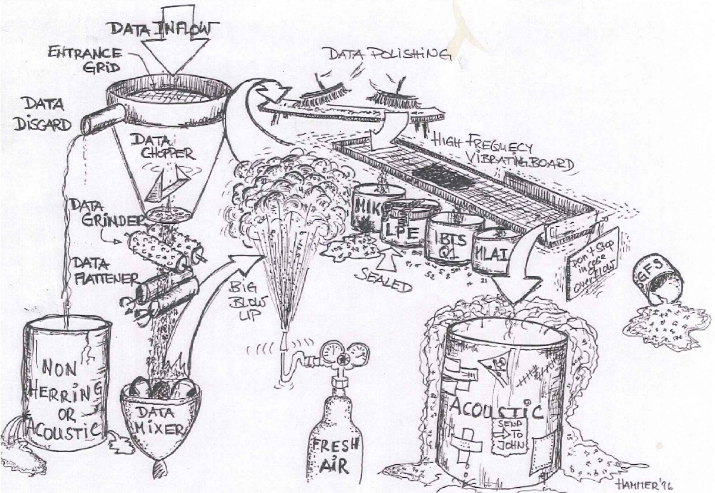

--- 
title: "DATRAS doodle"
subtitle: "... via tidyverse"
author: "Einar Hjörleifsson"
date: "`r Sys.Date()`"
site: bookdown::bookdown_site
output:
  bookdown::gitbook:
    fig_height: 6
    fig_width: 9
documentclass: book
bibliography: [ddoodle.bib]
biblio-style: apalike
link-citations: yes
github-repo: einarhjorleifsson/datrasdoodle
description: "Better find some dam description ..."
---

# Preamble {-}

The process that leads to fisheries advice involves multiple steps both on data munging and use (and potentially abuse) of models. The process can in many cases be described as a low-pass filter being passed to another low-pass filter passed on to yet another low-pass filter. During these steps the information in the raw data as well as the limitation of the processed data is sometimes lost. If only because the low-passers can be numerous and disparate and in the worste case spending time on doing "things" that either may be "tittlingaskítur"^[NOTE: explanation warranted] or abused later down the pipe.

I think this process is encapsulated pretty nicely in a drawing by [Cornelius Hammer](http://www.ices.dk/explore-us/who-we-are/Pages/President.aspx) done in his more innocent days in 1996:

```{r, echo = FALSE, out.width='100%', fig.cap = "... text pending ..."}

```

The scribble that follows contains snapshots/examples of tidyverse code used for data exploration analysis of scientific fisheries survey data that is one of the two pillars of data sources (the other being commercial catch-at-age) that forms the foundation of most advice. At present, the scribbles are a total mess, the space just a placeholder for some ad-hoc codes exploring the [DATRAS](http://datras.ices.dk) survey data (Figure \@ref(fig:allhauls)).

That resource is vast as depicted below, showing the most recently sampled hauls of the various surveys in the DATRAS database:

```{r allhauls, echo = FALSE, message = FALSE, warning = FALSE, fig.cap='Location of hauls of different surveys.'}
library(tidyverse)
library(gisland)
d <-
  read_rds("data/hh_datras.rds") %>% 
  filter(year == 2017)

d <-
  read_rds("data/hh_datras.rds") %>% 
  mutate(year = year + 1 / quarter) %>% 
  group_by(survey) %>% 
  filter(year == max(year))

icesarea <- 
  gisland::read_sf_ftp("fao-areas") %>%
  mutate(reg = str_sub(name, 1, 2)) %>%
  # only ICES areas
  filter(reg == "27") %>% 
  # turn the sf-object into sp-object so it can be used by calling geom_path
  as("Spatial")

m <- 
  map_data("world", xlim = c(-44, 36), ylim = c(30, 70)) %>% 
  filter(region != "Russia")
d %>% 
  ggplot() +
  theme_void() +
  geom_polygon(data = m, aes(long, lat, group = group), fill = "grey") +
  geom_path(data = icesarea, aes(long, lat, group = group), colour = "grey") +
  geom_point(aes(shootlong, shootlat, colour = survey),
             size = 0.5) +
  coord_map(projection = "orthographic",
            xlim = range(d$shootlong),
            ylim = range(d$shootlat)) +
  labs(colour = "Survey")
```


Mind you, there is an R package out there ([DATRAS](https://github.com/DTUAqua/DATRAS/tree/master/DATRAS)) that has some of the functionality needed to get the job done when munging DATRAS data to be fed into the TAC-machine. It is for all I have checked robust and succinct. It has a however only a rudimentary introductory [wiki](https://www.rforge.net/DATRAS/Tutorial.html).

The motivation for the scribbles here was primarily to explore and analyse survey data using the tidyverse verbs and workflow^[The scribbles are not to be considered as teaching the basics of the tidyverse coding framework, for that read [R for data science](http://r4ds.had.co.nz/) by @wickham2016r.]., with specific esoteric functions related to a particular kind of data format or model kept to the absolute bare minimum. Kind of a testing ground to see how far one could get without leaving the functions available in the tidyverse environment.

> The tidyverse is not just a collection of R packages, but a philosophy on how to work with data
> --- Ray Hoobler

[ref](https://bookdown.org/RayJamesHoobler/incompletesolutionsguide)
